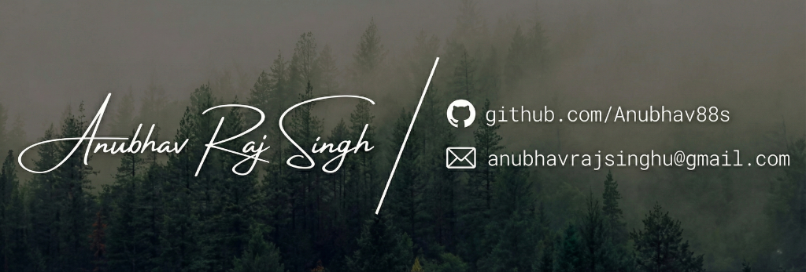

  

  
  
  

<h1 align="center">Hi there 👋, &lt; devs /&gt;</h1>

  My name is <b>Anubhav Raj Singh</b>. A passionate Full Stack Web Developer from India. My main areas of interest are <b>MERN Stack</b> and <b>Next.js</b> development. Right now, I'm learning <b>Typescript</b>. Aside from this, I enjoy solving real-world problems using clean code. In my spare time, I love turning ideas into code.

<h2 align="center">Tech Stack</h2>

<table width="100%">
  <tr>
    <td align="center" valign="top" width="33%">
      <h3>Frontend</h3>
      
    </td>
    <td align="center" valign="top" width="33%">
      <h3>Backend</h3>
      
    </td>
    <td align="center" valign="top" width="33%">
      <h3>Tools & Others</h3>
      
    </td>
  </tr>
</table>

<h2 align="center">Statistics</h2>

  
  

